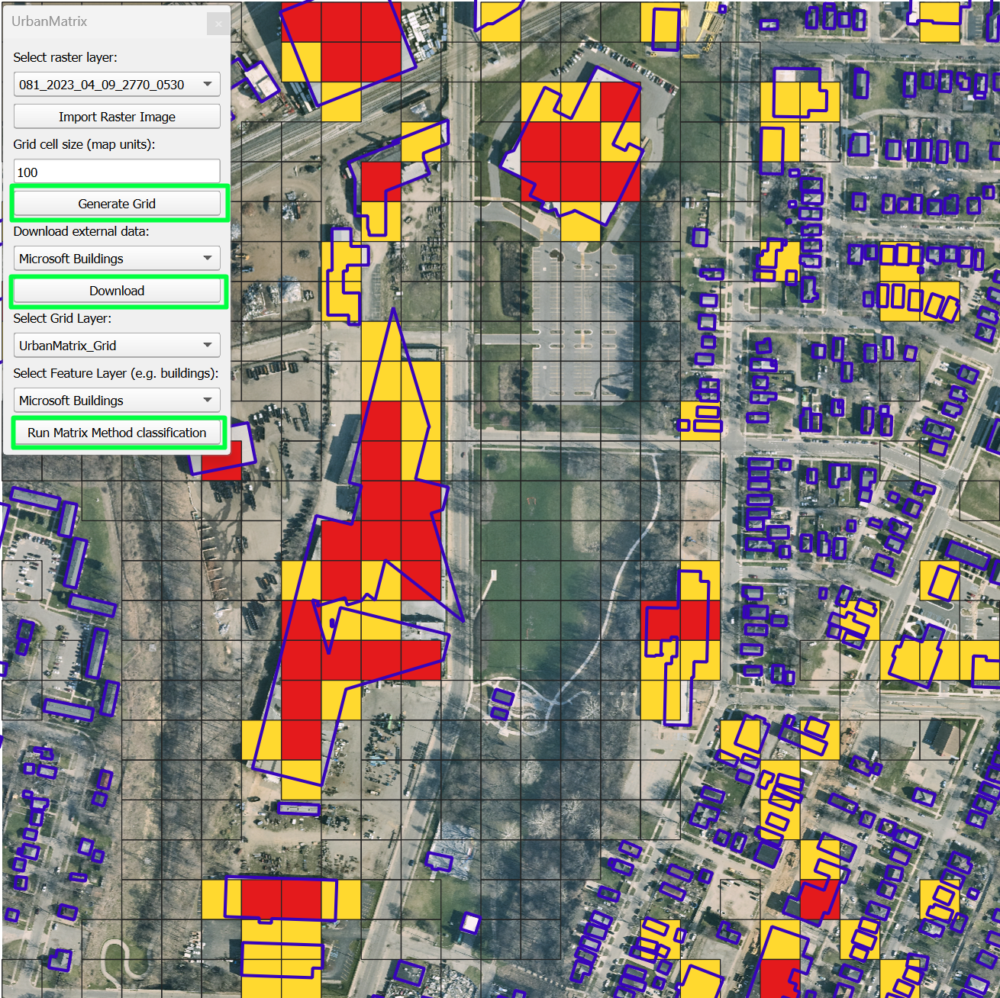

  

<h1 align="center">UrbanMatrix</h1>

  A QGIS plugin for spatial classification using the Matrix Method 🧮🏙️

---

## 💡 About the Plugin

**UrbanMatrix** helps urban planners and researchers apply the Matrix Method for multiple applications (Currently Developed for Building Density).\
It automates grid creation, layer import, building coverage analysis, classification, and styled visualization — all in one go.

---

## 🚀 Features

- 📐 Generate spatial grids of any resolution
- 🏢 Download and Postprocess Global ML Building Footprints from Microsoft
- 🧮 Calculate per-cell `application` --> currently implemented `Building Density`
- 🎯 Automatically assign Matrix Method risk classes
- 🎨 Predefined styling for buildings and classification results
- 🧼 Clean, minimal interface inside QGIS

---

## 🛠️ How to Use

1. Open QGIS
2. Open the UrbanMatrix panel (under Plugins)
3. Import or download a raster for background (optional)
4. Generate a grid over the visible extent
5. Download buildings or add your own feature layer
6. Run Matrix Method classification
7. Explore your results and export if needed

---

## 📷 Screenshots / Demos

<table>
  <tr>
    <td align="center">
      
      
<strong>Screenshot</strong>

    </td>
    <td align="center">
      
      
<strong><a href="https://youtu.be/xgnYrgwS6Fc">Watch Demo Video</a></strong>

    </td>
  </tr>
</table>

## 🧪 Current Status

This is a **beta release** — fully working but open for feedback and polish.  
You're welcome to try it, suggest improvements, or contribute!

---

## 🔧 Installation (Developer Mode)

1. Clone or download this repository
2. Copy it into your QGIS plugins folder:

---

## 🙋 Author & Contact

**Developed by:** Cristhian Sanchez - DFKI\
**Email:** [crivisan1994@gmail.com](mailto:crivisan1994@gmail.com)  
**GitHub:** [github.com/crivisan](https://github.com/crivisan)\
**Linkedin:** [linkedin.com/crivisan](https://www.linkedin.com/in/crivisan/)

Feel free to reach out for questions, feedback, or collaborations
